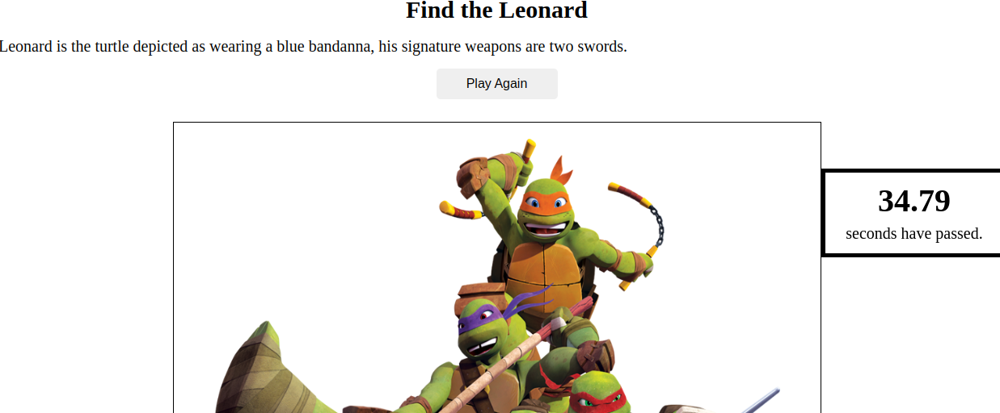
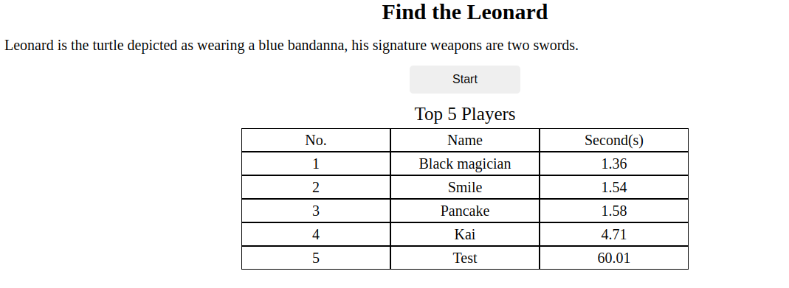

# 22_odin_where-s_waldo

[Task Description](https://www.theodinproject.com/lessons/node-path-javascript-where-s-waldo-a-photo-tagging-app)

[Live Preview](https://maxim55069633.github.io/22_odin_where-s_waldo/)

In this project, I combine Firebase backend services with my frontend functionality. I practice how to add, read, delete data in Firestore Database. 

I learn: 
1. Use `<map>` and `<area>` to make a part of image clickable.
2. What is env? How to use it to hide my API key.
3. Use async function inside useEffect

sample:

1. 

2. 

I use the following images from bing under the license: free to share and use:
1. [TMNT](https://cn.bing.com/images/search?view=detailV2&ccid=qwkY2yi2&id=956BA5906DEA78E0E4D09F442E5C7A5B4DBF89F1&thid=OIP.qwkY2yi2eLLiP4cpTwBj7AHaIl&mediaurl=https%3a%2f%2fts1.cn.mm.bing.net%2fth%2fid%2fR-C.ab0918db28b678b2e23f87294f0063ec%3frik%3d8Ym%252fTVt6XC5Enw%26riu%3dhttp%253a%252f%252fpngimg.com%252fuploads%252fninja_turtles%252fninja_turtles_PNG49.png%26ehk%3dZSBHLAgQTeLEcODGEXtFmrP4wadYiGHCMfr10DuDYUw%253d%26risl%3d%26pid%3dImgRaw%26r%3d0&exph=993&expw=857&q=teenage+mutant+ninja+turtles&simid=608023574053082502&FORM=IRPRST&ck=83235663984794A836DE443420DEA4D4&selectedIndex=20&qft=+filterui%3alicense-L2_L3_L4_L5_L6_L7&ajaxhist=0&ajaxserp=0)
2. [Leonard](https://cn.bing.com/images/search?view=detailV2&ccid=kwg%2fv05c&id=76C341A16DC56A5C30F64E7B872C5D4043A112EE&thid=OIP.kwg_v05cXrRA2augBruDnwAAAA&mediaurl=https%3a%2f%2fts1.cn.mm.bing.net%2fth%2fid%2fR-C.93083fbf4e5c5eb440d9aba006bb839f%3frik%3d7hKhQ0BdLId7Tg%26riu%3dhttp%253a%252f%252fit.wikifur.com%252fw%252fimages%252f5%252f57%252fLeoturtle.png%26ehk%3dC2SJBDxZUFvJ9OKbm5Hm2iTfLkwKYtoFVBRQzKUpW%252fU%253d%26risl%3d%26pid%3dImgRaw%26r%3d0&exph=468&expw=257&q=leonardo+tmnt&simid=608012235357245436&FORM=IRPRST&ck=887ECD555C88907A6E30DAE147823A5F&selectedIndex=3&qft=+filterui%3alicense-L2_L3_L4_L5_L6_L7&ajaxhist=0&ajaxserp=0)
3. [Raphael](https://cn.bing.com/images/search?view=detailV2&ccid=tiC%2bi7SN&id=7819902ADCF1C47EA9B798151F31F30195088535&thid=OIP.tiC-i7SNj6qArifuJplQRgAAAA&mediaurl=https%3a%2f%2fts1.cn.mm.bing.net%2fth%2fid%2fR-C.b620be8bb48d8faa80ae27ee26995046%3frik%3dNYUIlQHzMR8VmA%26riu%3dhttp%253a%252f%252fit.wikifur.com%252fw%252fimages%252fthumb%252fc%252fca%252fRafturtle.png%252f180px-Rafturtle.png%26ehk%3daR09MdA8F5D37DC%252bzLkq7UxIBRLJDHh8WZLt%252fdMkgyY%253d%26risl%3d%26pid%3dImgRaw%26r%3d0&exph=292&expw=180&q=raf+tmnt&simid=608015198888012175&FORM=IRPRST&ck=AFA921F596D71D89C69DA1978780E19D&selectedIndex=0&qft=+filterui%3alicense-L2_L3_L4_L5_L6_L7&ajaxhist=0&ajaxserp=0)
4. [Michelangelo](https://cn.bing.com/images/search?view=detailV2&ccid=Ot06GjIo&id=76991A597508F09DE17BEE3E854F73E8B47E9E09&thid=OIP.Ot06GjIo5fF_rC0RBV1IewHaLz&mediaurl=https%3a%2f%2fpngimg.com%2fuploads%2fninja_turtles%2fninja_turtles_PNG64.png&exph=759&expw=476&q=michelangelo+tmnt&simid=607999234488495026&FORM=IRPRST&ck=54C178A6AA707CDD187B5B30926FC0D4&selectedIndex=9&qft=+filterui%3alicense-L2_L3_L4_L5_L6_L7&ajaxhist=0&ajaxserp=0)
5. [Donatello](https://cn.bing.com/images/search?view=detailV2&ccid=S46KUP0b&id=C34C635C5DD6F734FE3FBB1B99AFC5075C5EBAB8&thid=OIP.S46KUP0bgpKTg5l4vw4QeAAAAA&mediaurl=https%3a%2f%2fts1.cn.mm.bing.net%2fth%2fid%2fR-C.4b8e8a50fd1b829293839978bf0e1078%3frik%3duLpeXAfFr5kbuw%26riu%3dhttp%253a%252f%252fit.wikifur.com%252fw%252fimages%252f1%252f17%252fDonnieturtle.png%26ehk%3dseRmosE0tiaO9WpSTJaVTNNXqs6Ul2AbhRRLQ5n%252b3N8%253d%26risl%3d%26pid%3dImgRaw%26r%3d0&exph=478&expw=230&q=donatello+tmnt&simid=608042626548310343&FORM=IRPRST&ck=C338ABB4F93365784AE63FA147889E81&selectedIndex=56&qft=+filterui%3alicense-L2_L3_L4_L5_L6_L7&ajaxhist=0&ajaxserp=0)